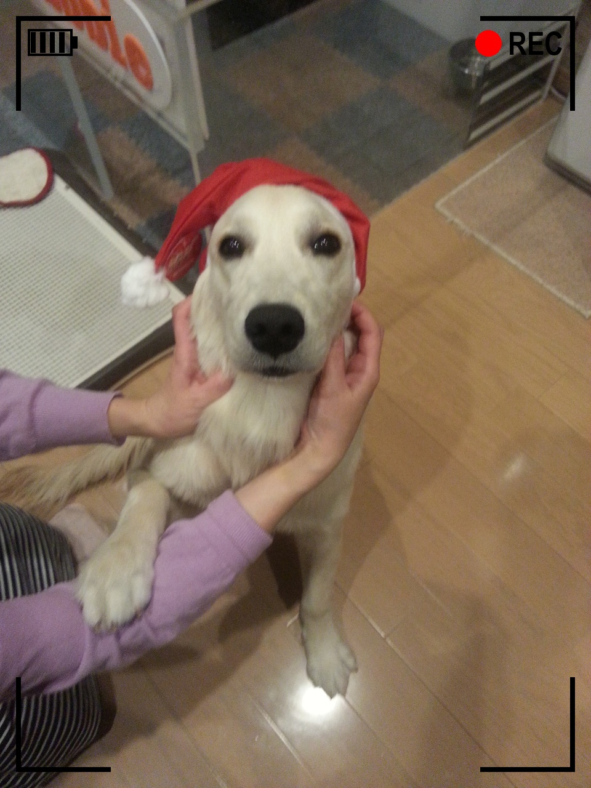
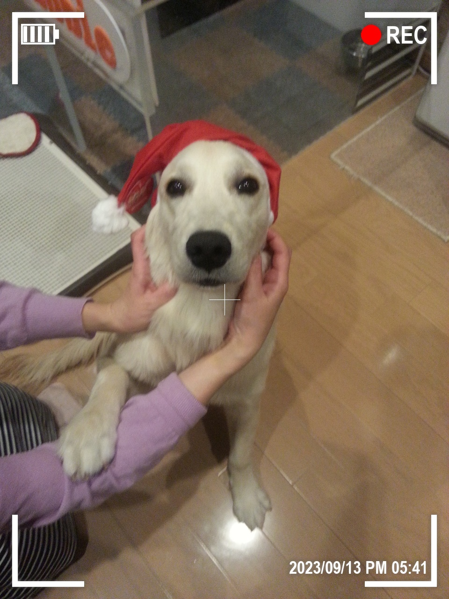
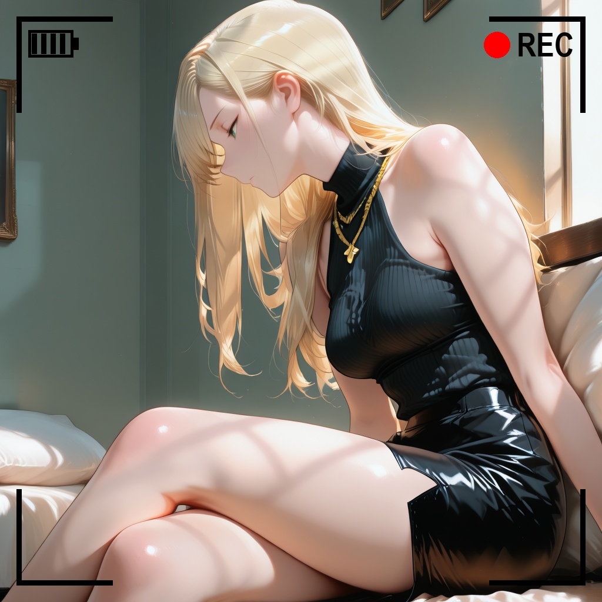
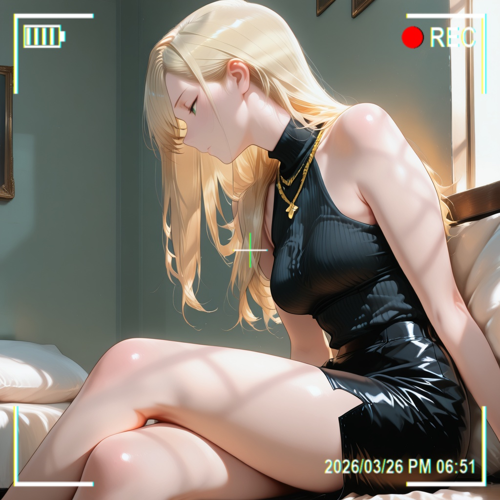

# rec-frame-app

任意の画像にカメラのファインダー風オーバーレイ（四隅枠＋電池＋赤丸REC）を合成するGUIアプリ。透過PNGの拡大縮小ではなく画像サイズからの相対値でベクター生成するため、どんな解像度でも比率が崩れません。

Camera viewfinder style overlay (corner brackets + battery + red REC dot) composited at relative scale, so any resolution keeps proportions.

紹介ページ: https://treeturtlefall-arch.github.io/rec-frame-app/landing/

## 作例 / Examples

|  |  |
|---|---|
| 黒・中・OFF（簡易） | 白・大・OLED＋十字＋日時（詳細） |
|  |  |
| 黒・中・OFF（簡易） | 白・中・2000s＋十字＋日時（詳細） |

## 使い方 / Usage

```bat
.venv\Scripts\python rec_frame_app.py
```

1. 「画像を開く…」で画像を選択（素材なしで試す場合は「サンプルで試す」）
2. 左の「スタイル」で色・フォント（所持フォントは「追加…」で登録可）・枠太さ・エフェクトを調整（プレビュー即時更新）
3. 「詳細」に切り替えると「表示・日時」タブが現れ、要素ごとのON/OFFや日時を設定できる。「写真の撮影日時を使う」はEXIF優先、無ければ更新時刻を使用
4. 「画像を保存 →」で合成画像を保存（`{元名}_rec{拡張子}`）。複数枚は左下の「フォルダを一括処理…」を使用

設定タブは小画面時だけスクロールし、内容が収まる場合はバーを自動で隠します。上部の開く・保存と左下の一括処理は固定です。`Ctrl+O` / `Ctrl+S` にも対応しています。

ヘッダーの「Language」で日本語と英語を即時に切り替えられます。このラベルは切替前でも英語話者が識別できるよう、両言語で固定表示します。選択は自動記憶され、画像・入力値・タブ状態を保ったまま表示だけが変わります。

```bat
rem CLI 一括処理（--config 省略時は自動記憶の設定を使用）
.venv\Scripts\python rec_frame_app.py --batch 入力フォルダ 出力フォルダ --config rec_frame_config.json
rem 英語CLI / English CLI
.venv\Scripts\python rec_frame_app.py --lang en --batch input output
```

## 対応形式 / Formats

入力: PNG / JPG / JPEG / WebP / BMP（EXIF Orientation 正規化）
出力: PNG / JPEG（quality=95）/ WebP

## 設定の記憶

枠色・フォント・枠太さ・エフェクト・要素ON/OFF・日時文・表示言語は自動保存されます（UI操作なし）。

- Windows: `%APPDATA%\rec-frame-app\config.json`
- Linux/macOS: `$XDG_CONFIG_HOME/rec-frame-app/config.json`

## 開発 / Development

Requires: Python 3.11+ / Pillow (see `requirements.txt`) / tkinter (stdlib).

```bat
.venv\Scripts\python -m pytest -q
```

構成: `rec_frame_app.py`（GUI薄層＋CLI）/ `rec_i18n.py`（日英翻訳層）/ `rec_overlay.py`（画像生成層）/ `rec_config.py`（設定層）/ `rec_batch.py`（一括処理層）。詳細仕様は `SPEC.md` が正本です。

フォントは OS のシステムフォントを使用し、リポジトリにフォントは同梱していません（No fonts bundled; uses system fonts with DejaVu fallback）。所持フォント（.ttf / .otf / .ttc）は「追加...」で登録でき、実体は設定フォルダ直下の `fonts/` にコピーして記憶します。

## ユースケース / Use Cases

サムネ・TRPG証拠品・旅行ログ・フォトブースなどの使い道とおすすめ設定は [`docs/USECASES.md`](docs/USECASES.md) にまとめています（See `docs/USECASES.md` for ideas and recommended settings）。

## 配布 / Download

- 一般ユーザー: GitHub Releases の `rec-frame-app.exe` をDLしてダブルクリック（Python不要、約17MB）。初回は署名なしのため SmartScreen が出ます（詳細情報→実行）。
- `rec-frame-app.exe --batch 入力フォルダ 出力フォルダ` でCLI一括処理も可。
- 自分でビルド: `.venv\Scripts\python -m pip install pyinstaller` 後に `.venv\Scripts\pyinstaller rec-frame-app.spec --clean --noconfirm`（成果物は `dist/`）。

## License

MIT (see `LICENSE`).
